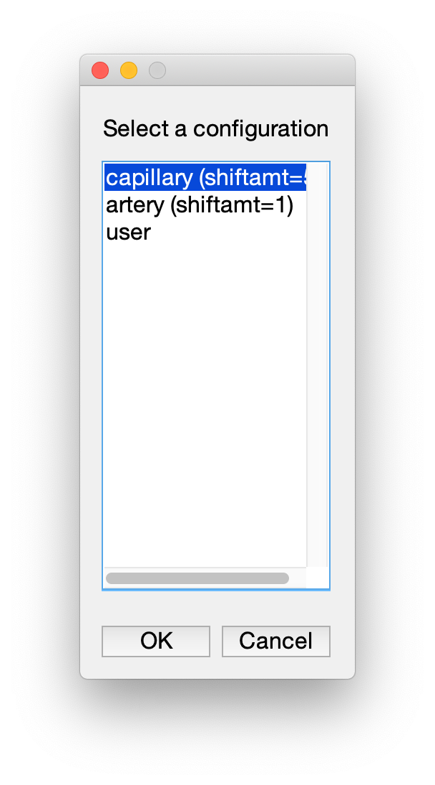

## Blood flow analysis from line scans

This code is designed to analyze repetitive line scans to extract blood flow. It proceeds in two steps.

 1. In Matlab, extract flow from raw .tif line scan files and save velocity to .txt files.
 2. In program of your choice, analyze resultant velocity measurements in .txt files across any number of analyzed files. We provide example Python code.

## Algorithms

Using algorithms and code from these three references:

 - [Drew at al (2010) Rapid determination of particle velocity from space-time images using the Radon transform. J Comput Neurosci 29(1-2):5-11.][drew-et-al-2010]
 - [Kim TN, Goodwill PW, Chen Y, Conolly SM, Schaffer CB, Liepmann D, Wang RA (2012) Line-Scanning Particle Image Velocimetry: An Optical Approach for Quantifying a Wide Range of Blood Flow Speeds in Live Animals. PLoS One 7:e38590.][kim-et-al-2012]
 - [Chhatbar PY, Kara P (2013) Improved blood velocity measurements with a hybrid image filtering and iterative Radon transform algorithm. Front Neurosci 7:106.][chhatbar-and-kara-2013]

[drew-et-al-2010]: https://pubmed.ncbi.nlm.nih.gov/19459038/
[kim-et-al-2012]: https://journals.plos.org/plosone/article?id=10.1371/journal.pone.0038590
[chhatbar-and-kara-2013]: https://www.frontiersin.org/articles/10.3389/fnins.2013.00106/full

## Requirements

 1. At least Matlab 2016b and works with 2022b. May work with other versions as well.

   - The Kim et al and Chhatbar and Kara algorithms requires the following toolboxes

    - Curve Fitting Toolbox
        - for Kim, fitoptions('gaussian1')

    - Parallel Computing Toolbox
        - for Kim, gcp('nocreate')

    - Image Processing Toolbox
        - for Chhatbar, radon transform

    - Statistics and Machine Learning Toolbox
        - Chhatbar, for proper version of nanvar(), built in nanvar() is not what you want and is over-written by this toolbox
        
 2. Source line scan files need to be .tif

 3. We need to read two acquisition parameters from each .tif file, the x voxel size along a line scan (delx, um/pixel) and the speed of each line scan (delt, ms/scan).
 
 We are assuming you are working with Olympus oir line scans and have exported them (using the Olympus software) to tif/txt files.
 
 <strike>The matlab code assumes you have done this with the Fiji script 'bFolder2MapManager.v0.2_.py'.

If the Fiji script does not work (e.g. with Olympus kymographs), you need to create a textfile with this informat. For example, for mykymograph.tif, you need to create mykymograph.txt with the following contents
</strike>

## Running the analysis

At the Matlab prompt, you need to `cd` into the folder with this code, something like

```
cd /Users/cudmore/Sites/analyze-flow/matlab
```

### AnalyzeFlow Matlab script

Run the `AnalyzeFlow` script from the Matlab command prompt to analyze one .tif file.

 1. Prompt for a tif file.
 <strike>
 2. Displays the Tiff and asks user to click start and then stop of analysis along the scanned line (X1, X2).
 3. Asks if it is an Artery (Vein) or capillary. This choice will modify one parameter for the Kim algorithm. Arteries/Veins are fast (shiftamt=1), while capillaries are slow (shiftamt=5).
 4. Perform both Kim and Chhatbar analysis.
 </strike>
 5. Save all analysis into .txt files.

### AnalyzeFlowFolder Matlab script

Run the `AnalyzeFlowFolder` script from the Matlab command prompt to analyze all .tif files in a selected folder.

 1. Prompts for a folder of .tif files
 2. Calls **AnalyzeFlow** for each .tif in the folder

### AnalyzeFlow Python Jupter notebook

Open the `AnalyzeFlow.ipynb` in Python's Jupyter to analyze entire folders of saved velocty .txt files.


## AnalyzeFlow Interface

Dec 2022, we have turned this off for now. There is no prompt when you run `AnalyzeFlow`.

 1. Run `AnalyzeFlow` at Matlab command prompt
 2. Select a .tif image to analyze.
 3. `AnalyzeFlow` will display the image. On the left is the full image, in the center is the first 1000 lines, and on the right are the last 1000 lines. Use the mouse pointer and cursors to click the start and then stop points along the x-axis. The position along the y-axis is ignored.

 
 4. Select either 'capillary' or 'artery/vein'. This will set the `shiftamt` parameter for the Kim algorithm. In general arteries have fast flow and capillaries have slow flow.
 
 

 5. The flow analysis is saved as a `_combined.txt` file in the same folder as the original .tif file.

## AnalyzeFlow output .txt files

The save .txt file looks like the example below. Note, we are only showing 7 velocity measurements from both the Kim and Chhatbar algorithms, there will actually be many more.

These files are easy to load and parse in a number of analysis programs. See the [python/](python/) folder for examples.

| filepath                                                             | file               | acqDate    | acqTime            | analysisDate | analysisTime | pntsPerLine | numLines | delx     | delt     | x1 | x2 | algorithm | k_numavgs | k_skipamt | k_shiftamt | c_hi | c_lineskip | time        | velocity  | 
|----------------------------------------------------------------------|--------------------|------------|--------------------|--------------|--------------|-------------|----------|----------|----------|----|----|-----------|-----------|-----------|------------|------|------------|-------------|-----------| 
| /Users/cudmore/box/data/nathan/20190613/Converted/20190613__0020.tif | 20190613__0020.tif | 2019-06-13 | 13:12:57.221-07:00 | 20190619     | 12:27:55     | 42          | 10000    | 0.994369 | 1.530000 | 6  | 37 | kim       | 100       | 25        | 1          | NaN  | NaN        | 38.250000   | -0.672911 | 
| /Users/cudmore/box/data/nathan/20190613/Converted/20190613__0020.tif | 20190613__0020.tif | 2019-06-13 | 13:12:57.221-07:00 | 20190619     | 12:27:55     | 42          | 10000    | 0.994369 | 1.530000 | 6  | 37 | kim       | 100       | 25        | 1          | NaN  | NaN        | 76.500000   | -0.637624 | 
| /Users/cudmore/box/data/nathan/20190613/Converted/20190613__0020.tif | 20190613__0020.tif | 2019-06-13 | 13:12:57.221-07:00 | 20190619     | 12:27:55     | 42          | 10000    | 0.994369 | 1.530000 | 6  | 37 | kim       | 100       | 25        | 1          | NaN  | NaN        | 114.750000  | -0.601160 | 
| /Users/cudmore/box/data/nathan/20190613/Converted/20190613__0020.tif | 20190613__0020.tif | 2019-06-13 | 13:12:57.221-07:00 | 20190619     | 12:27:55     | 42          | 10000    | 0.994369 | 1.530000 | 6  | 37 | kim       | 100       | 25        | 1          | NaN  | NaN        | 153.000000  | -0.579518 | 
| /Users/cudmore/box/data/nathan/20190613/Converted/20190613__0020.tif | 20190613__0020.tif | 2019-06-13 | 13:12:57.221-07:00 | 20190619     | 12:27:55     | 42          | 10000    | 0.994369 | 1.530000 | 6  | 37 | kim       | 100       | 25        | 1          | NaN  | NaN        | 191.250000  | -0.583120 | 
| /Users/cudmore/box/data/nathan/20190613/Converted/20190613__0020.tif | 20190613__0020.tif | 2019-06-13 | 13:12:57.221-07:00 | 20190619     | 12:27:55     | 42          | 10000    | 0.994369 | 1.530000 | 6  | 37 | kim       | 100       | 25        | 1          | NaN  | NaN        | 229.500000  | -0.581488 | 
| /Users/cudmore/box/data/nathan/20190613/Converted/20190613__0020.tif | 20190613__0020.tif | 2019-06-13 | 13:12:57.221-07:00 | 20190619     | 12:27:55     | 42          | 10000    | 0.994369 | 1.530000 | 6  | 37 | kim       | 100       | 25        | 1          | NaN  | NaN        | 267.750000  | -0.592656 | 
| /Users/cudmore/box/data/nathan/20190613/Converted/20190613__0020.tif | 20190613__0020.tif | 2019-06-13 | 13:12:57.221-07:00 | 20190619     | 12:27:55     | 42          | 10000    | 0.994369 | 1.530000 | 6  | 37 | chhatbar  | NaN       | NaN       | NaN        | 100  | 25         | 1799.280000 | -0.552622 | 
| /Users/cudmore/box/data/nathan/20190613/Converted/20190613__0020.tif | 20190613__0020.tif | 2019-06-13 | 13:12:57.221-07:00 | 20190619     | 12:27:55     | 42          | 10000    | 0.994369 | 1.530000 | 6  | 37 | chhatbar  | NaN       | NaN       | NaN        | 100  | 25         | 1837.530000 | -0.553482 | 
| /Users/cudmore/box/data/nathan/20190613/Converted/20190613__0020.tif | 20190613__0020.tif | 2019-06-13 | 13:12:57.221-07:00 | 20190619     | 12:27:55     | 42          | 10000    | 0.994369 | 1.530000 | 6  | 37 | chhatbar  | NaN       | NaN       | NaN        | 100  | 25         | 1875.780000 | -0.531908 | 
| /Users/cudmore/box/data/nathan/20190613/Converted/20190613__0020.tif | 20190613__0020.tif | 2019-06-13 | 13:12:57.221-07:00 | 20190619     | 12:27:55     | 42          | 10000    | 0.994369 | 1.530000 | 6  | 37 | chhatbar  | NaN       | NaN       | NaN        | 100  | 25         | 1914.030000 | -0.547489 | 
| /Users/cudmore/box/data/nathan/20190613/Converted/20190613__0020.tif | 20190613__0020.tif | 2019-06-13 | 13:12:57.221-07:00 | 20190619     | 12:27:55     | 42          | 10000    | 0.994369 | 1.530000 | 6  | 37 | chhatbar  | NaN       | NaN       | NaN        | 100  | 25         | 1952.280000 | -0.572237 | 
| /Users/cudmore/box/data/nathan/20190613/Converted/20190613__0020.tif | 20190613__0020.tif | 2019-06-13 | 13:12:57.221-07:00 | 20190619     | 12:27:55     | 42          | 10000    | 0.994369 | 1.530000 | 6  | 37 | chhatbar  | NaN       | NaN       | NaN        | 100  | 25         | 1990.530000 | -0.617104 | 
| /Users/cudmore/box/data/nathan/20190613/Converted/20190613__0020.tif | 20190613__0020.tif | 2019-06-13 | 13:12:57.221-07:00 | 20190619     | 12:27:55     | 42          | 10000    | 0.994369 | 1.530000 | 6  | 37 | chhatbar  | NaN       | NaN       | NaN        | 100  | 25         | 2028.780000 | -0.618527 | 

## Assumptions and important parameters

This analysis assumes that both the scan speed of each line (delt) and the voxel size of each pixel (delx) is known.

<strike>
We use Fiji scripts to read native scope file formats, in particular Olympus OIR files, to extract this information into a .txt file where Matlab cen then read it. The code can be modified to do otherwise.
</strike>

The Kim algorithm has parameters and **shiftamt** has to be set for slow (capillaries) and fast (arteries and veins)

```
numavgs = 100;
skipamt = 25;
shiftamt = 5; % capillary (slow)
%shiftamt = 1; % artery (fast)
```

The Chhatbar algorithm has parameters but everything seems to work with default parameters.

```
hi = 100;
lineskip = 25;
```

## exampleData

 - Example tif files

## To Do

 - Remove outliers. Do this by apending a 'reject' column on load. Then, set 'reject =True' if > 2*SD. When plotting, don't plot reject. When taking mean, don't use reject.
 - Update matlab code with interface to select art/vein or cap (sets one parameter)
 - Get b/w kim and chhatbar stats working
 - Get start/stop stats for trial working (both t-test and % change)
 - Figure out how to get more info in analysis (trial grouping, flag a file as bad, ...)
 
 - Get stats working. There seem to be some bad values? Maybe the nan I set when removing outliers (which will be removed in future in preference for 'reject' column.

 - Need to bypass reading Tiff header info from bImPy (too hard to install)
  
  - 1) revamp Fiji code to read stack headers
  - 2) in Matlab make a 'cheatsheet.csv' for each folder, each row is a .tif file with (delx, delt, date, time, etc)
  
[bImPy]: https://github.com/cudmore/bImPy
